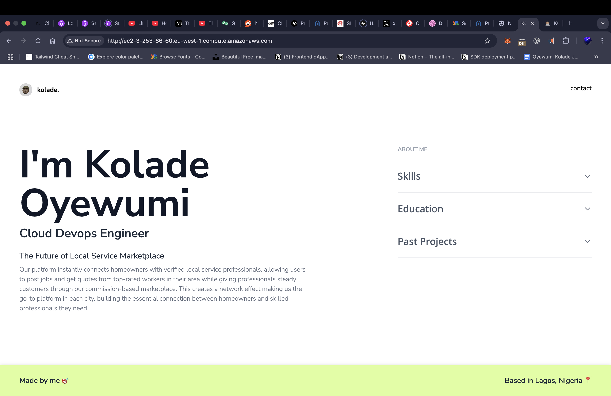

## 🌐 Live Demo

- **Website URL:** [https://kolade.site](https://kolade.site) <br />
- **Public IP**: http://ec2-3-253-66-60.eu-west-1.compute.amazonaws.com/ <br /> <br />

## 📸 Screenshot




## 🚀 Project Overview

This project demonstrates the deployment of a React application to AWS EC2 infrastructure with production-ready configurations including:
- AWS EC2 server provisioning
- Nginx web server setup
- SSL certificate configuration with Let's Encrypt
- Custom domain configuration
- Security hardening with UFW firewall


## Steps for this Alt Cloud Task

## Step 1: Provisioning AWS EC2 Server
### Launch EC2 Instance

-  Go to AWS Console > EC2 > Launch Instance
- Choose: Ubuntu Server 22.04 LTS (Free Tier eligible)
- Instance Type: t2.micro (Free Tier)
- Key Pair: Create new or use existing
- Security Group: Create new with these rules:

```js
SSH (22) - Your IP only
HTTP (80) - 0.0.0.0/0
HTTPS (443) - 0.0.0.0/0
```

### Connect to Server
```js
ssh -i my-key.pem ubuntu@ec2-3-253-66-60.eu-west-1.compute.amazonaws.com
```


## Step 2: Server Setup & Dependencies
### Update system:
```js
bashsudo apt update && sudo apt upgrade -y
```

### Install Node.js & npm:
```js
bashcurl -fsSL https://deb.nodesource.com/setup_18.x | sudo -E bash -
sudo apt-get install -y nodejs
```

### Install Nginx:
```js
bashsudo apt install nginx -y
sudo systemctl start nginx
sudo systemctl enable nginx
  ```


## Step 3: Deploy Your React App
### Build your app locally:
```js
npm run build
  ```

### Transfer files to server:
```js
git clone https://github.com/corlard3y/altcloud-task
cd altcloud-task
npm install
npm run build
````

## Step 4: Configure Nginx
### Create Nginx config:

```js
sudo nano /etc/nginx/sites-available/altcloud-task
```

### Add this configuration:

```js
# HTTP server block for domain (redirects to HTTPS)
server {
    listen 80;
    server_name kolade.site www.kolade.site;
    return 301 https://$host$request_uri;
}

# HTTP server block for EC2 hostname (no SSL redirect)
server {
    listen 80;
    server_name ec2-3-253-66-60.eu-west-1.compute.amazonaws.com;

    root /home/ubuntu/altcloud-task/dist;
    index index.html;

    location / {
        try_files $uri $uri/ /index.html;
    }

    # Gzip compression
    gzip on;
    gzip_types text/css application/javascript application/json;

    # Cache static assets
    location ~* \.(js|css|png|jpg|jpeg|gif|ico|svg)$ {
        expires 1y;
        add_header Cache-Control "public, immutable";
    }
}

# HTTPS server block for domain only
server {
    listen 443 ssl;
    server_name kolade.site www.kolade.site;

    ssl_certificate /etc/letsencrypt/live/kolade.site/fullchain.pem;
    ssl_certificate_key /etc/letsencrypt/live/kolade.site/privkey.pem;
    include /etc/letsencrypt/options-ssl-nginx.conf;
    ssl_dhparam /etc/letsencrypt/ssl-dhparams.pem;

    root /home/ubuntu/altcloud-task/dist;
    index index.html;

    location / {
        try_files $uri $uri/ /index.html;
    }

    # Gzip compression
    gzip on;
    gzip_types text/css application/javascript application/json;

    # Cache static assets
    location ~* \.(js|css|png|jpg|jpeg|gif|ico|svg)$ {
        expires 1y;
        add_header Cache-Control "public, immutable";
    }
}
```

### Enable the site:

```js
sudo ln -s /etc/nginx/sites-available/your-app /etc/nginx/sites-enabled/
sudo rm /etc/nginx/sites-enabled/default
sudo nginx -t
sudo systemctl reload nginx
```
if you get any error about bucket size, check the configuration file

```js
sudo vim /etc/nginx/nginx.conf
```

Find the http block and add this line inside it:
```js
http {
    server_names_hash_bucket_size 128;

    # ... rest of your config
}
```

### make the entire path readable:
```js
chmod 755 /home/ubuntu
chmod -R 755 /home/ubuntu/altcloud-task
```


## Step 5: Configure Domain DNS (GoDaddy)
```js
In your GoDaddy DNS settings, add these A record:
Type: A
Name: @
Value: 3.253.66.60
TTL: 600
```


## Step 6: Configure SSL with Vertbot

```js
### Install snapd (if not already installed)
sudo apt install snapd

### Install Certbot
sudo snap install --classic certbot

### Create symlink
sudo ln -s /snap/bin/certbot /usr/bin/certbot

### Get SSL certificate for domain
sudo certbot --nginx -d kolade.site -d www.kolade.site
```


## Step 7: Setup Firewall
### Configure UFW firewall

```js
sudo ufw allow ssh
sudo ufw allow 'Nginx Full'
sudo ufw enable
```

### Check firewall status
```js
sudo ufw status
```


## Step 8: Deploy
### Create deployment script
```js
nano /home/ubuntu/deploy.sh
```

```js
#!/bin/bash
echo "Starting deployment..."

cd /home/ubuntu/altcloud-task

# Pull latest changes
git pull origin main

# Install dependencies
npm install

# Build application
npm run build

# Reload Nginx
sudo systemctl reload nginx

echo "Deployment complete!"
echo "Site accessible at: https://kolade.site"
  ```

### Make script executable
```js
chmod +x /home/ubuntu/deploy.sh
```

# Deploy the changes continually
```js
  ./deploy.sh
```
